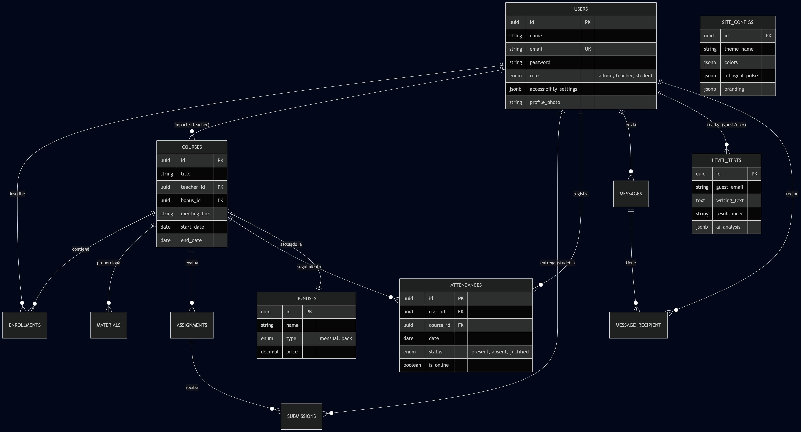

# 05. Diseño del Sistema

## 5.1. Diagrama Entidad-Relación (ER)

## 5.2. Diccionario de Datos Detallado

### Tabla: users (Usuarios)
| Campo | Tipo | Restricciones | Descripción |
| :--- | :--- | :--- | :--- |
| id | UUID | PK | Identificador único universal. |
| name | String | Not Null | Nombre completo del usuario. |
| email | String | Unique, Not Null | Correo electrónico de acceso. |
| role | Enum | admin, teacher, student | Rol para control de acceso (RBAC). |
| accessibility_settings | JSONB | Nullable | Configuración de UI (dislexia, daltonismo). |
| profile_photo | String | Nullable | Ruta a la imagen de perfil. |

### Tabla: courses (Cursos/Grupos)
| Campo | Tipo | Restricciones | Descripción |
| :--- | :--- | :--- | :--- |
| id | UUID | PK | Identificador único del curso. |
| title | String | Not Null | Nombre del grupo o curso de idiomas. |
| teacher_id | UUID | FK (users.id) | Profesor asignado como responsable. |
| bonus_id | UUID | FK (bonuses.id) | Tipo de bono/pago asociado. |
| meeting_link | String | Nullable | Enlace a sala virtual (Zoom/Meet). |

### Tabla: bonuses (Bonos y Contratos)
| Campo | Tipo | Restricciones | Descripción |
| :--- | :--- | :--- | :--- |
| id | UUID | PK | Identificador único del bono. |
| name | String | Not Null | Nombre del bono (Ej: Bono 10h). |
| type | Enum | mensual, pack | Modalidad de pago o consumo. |
| price | Decimal | Not Null | Precio base del servicio. |

### Tabla: attendances (Control de Asistencia)
| Campo | Tipo | Restricciones | Descripción |
| :--- | :--- | :--- | :--- |
| id | UUID | PK | Identificador del registro. |
| user_id | UUID | FK (users.id) | Alumno relacionado. |
| course_id | UUID | FK (courses.id) | Curso donde se toma asistencia. |
| date | Date | Not Null | Fecha de la clase. |
| status | Enum | present, absent, justified | Estado de asistencia. |
| is_online | Boolean | Default False | Indica si la asistencia fue en aula virtual. |

### Tabla: assignments (Tareas)
| Campo | Tipo | Restricciones | Descripción |
| :--- | :--- | :--- | :--- |
| id | UUID | PK | Identificador único de la tarea. |
| course_id | UUID | FK (courses.id) | Curso al que pertenece la tarea. |
| title | String | Not Null | Título de la actividad. |
| description | Text | Not Null | Instrucciones detalladas. |
| due_date | DateTime | Nullable | Fecha y hora límite de entrega. |

### Tabla: submissions (Entregas de Alumnos)
| Campo | Tipo | Restricciones | Descripción |
| :--- | :--- | :--- | :--- |
| id | UUID | PK | Identificador único de la entrega. |
| assignment_id | UUID | FK (assignments.id)| Tarea relacionada. |
| student_id | UUID | FK (users.id) | Alumno que realiza la entrega. |
| content | Text | Nullable | Texto o respuesta de la tarea. |
| file_path | String | Nullable | Ruta al archivo adjunto (PDF/Imagen). |
| grade | Decimal | Nullable | Calificación numérica. |
| teacher_feedback | Text | Nullable | Comentarios del docente. |

### Tabla: messages (Mensajería Interna)
| Campo | Tipo | Restricciones | Descripción |
| :--- | :--- | :--- | :--- |
| id | UUID | PK | Identificador del mensaje. |
| sender_id | UUID | FK (users.id) | Usuario que envía el mensaje. |
| body | Text | Not Null | Contenido del mensaje. |

### Tabla: message_recipient (Pivote Mensajería)
| Campo | Tipo | Restricciones | Descripción |
| :--- | :--- | :--- | :--- |
| message_id | UUID | FK (messages.id) | Mensaje relacionado. |
| recipient_id | UUID | FK (users.id) | Usuario que recibe el mensaje. |
| read_at | DateTime | Nullable | Fecha y hora de lectura (Confirmación). |

### Tabla: level_tests (Prueba de Nivel IA)
| Campo | Tipo | Restricciones | Descripción |
| :--- | :--- | :--- | :--- |
| id | UUID | PK | Identificador de la prueba. |
| guest_email | String | Not Null | Email del invitado para captación. |
| writing_text | Text | Not Null | Redacción enviada por el usuario. |
| result_mcer | String | Not Null | Nivel detectado (A1-C2). |
| ai_analysis | JSONB | Not Null | Desglose detallado del feedback de la IA. |

### Tabla: site_configs (Marca Blanca)
| Campo | Tipo | Restricciones | Descripción |
| :--- | :--- | :--- | :--- |
| id | UUID | PK | Identificador de configuración. |
| theme_name | String | Not Null | Nombre de la plantilla elegida. |
| colors | JSONB | Not Null | Mapa de colores (primary, secondary, etc). |
| bilingual_pulse | JSONB | Not Null | Lista de términos ES/EN para la UI. |
| branding | JSONB | Not Null | Logos y nombres de la academia. |

## 5.3. Justificación del Diseño Técnico

### 5.3.1. Uso de UUID v4
Se ha sustituido el uso de IDs autoincrementales por **UUID (Universally Unique Identifier)**. Esta decisión técnica responde a dos necesidades:
1.  **Seguridad:** Evita que usuarios malintencionados puedan predecir el volumen de datos o acceder a registros mediante la manipulación de la URL (Insecure Direct Object Reference).
2.  **Desacoplamiento:** Facilita la sincronización de datos en el futuro si la aplicación escala a un entorno de microservicios o bases de datos distribuidas.

### 5.3.2. Optimización con JSONB
El uso del tipo **JSONB de PostgreSQL** es una pieza clave para el motor de Marca Blanca (Theming Engine) y la Accesibilidad. A diferencia del tipo JSON plano, JSONB almacena los datos en un formato binario descompuesto, lo que permite:
- Indexación de atributos internos.
- Mayor velocidad de procesamiento en el servidor.
- Flexibilidad total para añadir nuevos parámetros de accesibilidad o diseño sin necesidad de realizar migraciones de esquema complejas.

### 5.3.3. Integridad y Normalización
El modelo sigue la **Tercera Forma Normal (3FN)** para evitar la redundancia de datos. La gestión de mensajería masiva se ha resuelto mediante una tabla pivote (`message_recipient`), permitiendo que un docente envíe un único mensaje a 20 alumnos ahorrando un 95% de espacio en disco en comparación con modelos que duplican el cuerpo del mensaje por cada destinatario.