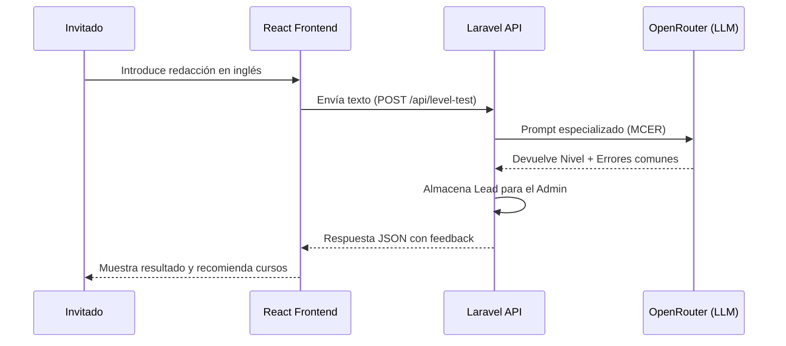

# 05. Diseño del Sistema

## Índice
1. [Diagrama entidad-relación de la base de datos](#1-diagrama-entidad-relación-de-la-base-de-datos)
2. [Diccionario de datos detallado](#2-diccionario-de-datos-detallado)
3. [Diagrama de casos de uso](#3-diagrama-de-casos-de-uso)
4. [Diagramas de flujo de los procesos principales](#4-diagramas-de-flujo-de-los-procesos-principales)
5. [Arquitectura de la aplicación](#5-arquitectura-de-la-aplicación)
6. [Diseño de la API (endpoints, métodos, respuestas)](#6-diseño-de-la-api-endpoints-métodos-respuestas)
7. [Justificación del diseño técnico](#7-justificación-del-diseño-técnico)

---


## 1. Diagrama Entidad-Relación

El modelo de datos ha sido diseñado para cubrir de forma integral las necesidades de una academia de inglés, permitiendo una trazabilidad total desde la captación del alumno (Test de IA) hasta su evaluación final.


### Justificación técnica del modelo:
*   **Gestión de Usuarios y Seguridad:** Se implementa un sistema de roles para segmentar las funcionalidades de Administrador, Docente y Alumno.
*   **Estructura Académica:** La relación entre `users` y `courses` se gestiona mediante una tabla intermedia de `enrollments` (matrículas), permitiendo que un alumno se inscriba en varios niveles (ej: B2 por la mañana, C1 de refuerzo por la tarde).
*   **Interacción y Evaluación:** Las tablas `assignments` y `submissions` permiten el control de entregas de redacciones y ejercicios, fundamentales en el aprendizaje de idiomas.
*   **Sistema de Mensajería:** Se utiliza una estructura relacional para mensajes internos que garantiza la comunicación directa profesor-alumno sin depender de servicios externos.
*   **White Label:** La tabla `site_configs` almacena en formato JSON las preferencias estéticas, permitiendo la inyección dinámica de estilos SASS en el frontend.

---

## 2. Diccionario de Datos Detallado

### Tabla: users (Usuarios)
| Campo | Tipo | Restricciones | Descripción |
| :--- | :--- | :--- | :--- |
| id | UUID | PK | Identificador único universal. |
| name | String | Not Null | Nombre completo del usuario. |
| email | String | Unique, Not Null | Correo electrónico de acceso. |
| role | Enum | admin, teacher, student | Rol para control de acceso (RBAC). |
| accessibility_settings | JSONB | Nullable | Configuración de UI (dislexia, daltonismo). |
| profile_photo | String | Nullable | Ruta a la imagen de perfil. |

### Tabla: courses (Cursos/Grupos)
| Campo | Tipo | Restricciones | Descripción |
| :--- | :--- | :--- | :--- |
| id | UUID | PK | Identificador único del curso. |
| title | String | Not Null | Nombre del grupo o curso de idiomas. |
| teacher_id | UUID | FK (users.id) | Profesor asignado como responsable. |
| bonus_id | UUID | FK (bonuses.id) | Tipo de bono/pago asociado. |
| meeting_link | String | Nullable | Enlace a sala virtual (Zoom/Meet). |

### Tabla: bonuses (Bonos y Contratos)
| Campo | Tipo | Restricciones | Descripción |
| :--- | :--- | :--- | :--- |
| id | UUID | PK | Identificador único del bono. |
| name | String | Not Null | Nombre del bono (Ej: Bono 10h). |
| type | Enum | mensual, pack | Modalidad de pago o consumo. |
| price | Decimal | Not Null | Precio base del servicio. |

### Tabla: attendances (Control de Asistencia)
| Campo | Tipo | Restricciones | Descripción |
| :--- | :--- | :--- | :--- |
| id | UUID | PK | Identificador del registro. |
| user_id | UUID | FK (users.id) | Alumno relacionado. |
| course_id | UUID | FK (courses.id) | Curso donde se toma asistencia. |
| date | Date | Not Null | Fecha de la clase. |
| status | Enum | present, absent, justified | Estado de asistencia. |
| is_online | Boolean | Default False | Indica si la asistencia fue en aula virtual. |

### Tabla: assignments (Tareas)
| Campo | Tipo | Restricciones | Descripción |
| :--- | :--- | :--- | :--- |
| id | UUID | PK | Identificador único de la tarea. |
| course_id | UUID | FK (courses.id) | Curso al que pertenece la tarea. |
| title | String | Not Null | Título de la actividad. |
| description | Text | Not Null | Instrucciones detalladas. |
| due_date | DateTime | Nullable | Fecha y hora límite de entrega. |

### Tabla: submissions (Entregas de Alumnos)
| Campo | Tipo | Restricciones | Descripción |
| :--- | :--- | :--- | :--- |
| id | UUID | PK | Identificador único de la entrega. |
| assignment_id | UUID | FK (assignments.id)| Tarea relacionada. |
| student_id | UUID | FK (users.id) | Alumno que realiza la entrega. |
| content | Text | Nullable | Texto o respuesta de la tarea. |
| file_path | String | Nullable | Ruta al archivo adjunto (PDF/Imagen). |
| grade | Decimal | Nullable | Calificación numérica. |
| teacher_feedback | Text | Nullable | Comentarios del docente. |

### Tabla: messages (Mensajería Interna)
| Campo | Tipo | Restricciones | Descripción |
| :--- | :--- | :--- | :--- |
| id | UUID | PK | Identificador del mensaje. |
| sender_id | UUID | FK (users.id) | Usuario que envía el mensaje. |
| body | Text | Not Null | Contenido del mensaje. |

### Tabla: message_recipient (Pivote Mensajería)
| Campo | Tipo | Restricciones | Descripción |
| :--- | :--- | :--- | :--- |
| message_id | UUID | FK (messages.id) | Mensaje relacionado. |
| recipient_id | UUID | FK (users.id) | Usuario que recibe el mensaje. |
| read_at | DateTime | Nullable | Fecha y hora de lectura (Confirmación). |

### Tabla: level_tests (Prueba de Nivel IA)
| Campo | Tipo | Restricciones | Descripción |
| :--- | :--- | :--- | :--- |
| id | UUID | PK | Identificador de la prueba. |
| guest_email | String | Not Null | Email del invitado para captación. |
| writing_text | Text | Not Null | Redacción enviada por el usuario. |
| result_mcer | String | Not Null | Nivel detectado (A1-C2). |
| ai_analysis | JSONB | Not Null | Desglose detallado del feedback de la IA. |

### Tabla: site_configs (Marca Blanca)
| Campo | Tipo | Restricciones | Descripción |
| :--- | :--- | :--- | :--- |
| id | UUID | PK | Identificador de configuración. |
| theme_name | String | Not Null | Nombre de la plantilla elegida. |
| colors | JSONB | Not Null | Mapa de colores (primary, secondary, etc). |
| bilingual_pulse | JSONB | Not Null | Lista de términos ES/EN para la UI. |
| branding | JSONB | Not Null | Logos y nombres de la academia. |


---

## 3. Diagrama de Casos de Uso

Este diagrama identifica cómo los diferentes actores interactúan con las funcionalidades clave de OpenClassy.

| Actor | Casos de Uso Principales |
| :--- | :--- |
| **Invitado** | Consultar catálogo de cursos, calcular presupuestos, realizar Prueba de Nivel (IA), enviar contacto. |
| **Alumno** | Consultar materiales, entregar tareas/redacciones, ver notas (PDF), chat con profesor. |
| **Docente** | Gestionar materiales didácticos, calificar entregas, gestionar sala de clase virtual, enviar avisos. |
| **Admin** | CRUD de usuarios y cursos, analítica de Leads del Test IA, configuración de Marca Blanca. |

```mermaid
usecaseDiagram
    actor "Invitado" as G
    actor "Alumno" as S
    actor "Docente" as T
    actor "Admin" as A

    G --> (Realizar Test Nivel IA)
    G --> (Calcular Presupuesto)
    S --> (Entregar Redacción)
    S --> (Exportar Notas PDF)
    T --> (Calificar Tarea)
    T --> (Gestionar Sala Virtual)
    A --> (Configurar White Label)
    A --> (Gestionar Matriculaciones)
```

## 4. Diagramas de flujo de los procesos principales

### 4.1 Proceso de Evaluación con IA (Captación)
Este flujo representa la integración de la inteligencia artificial para resolver el cuello de botella de las pruebas de nivel manuales.


---

## 5. Arquitectura de la aplicación

OpenClassy emplea una **arquitectura desacoplada (Headless)**. Esta decisión permite que el cliente (Frontend) y el servidor (Backend) se comuniquen exclusivamente mediante una interfaz de datos, facilitando el mantenimiento y la escalabilidad.

*   **Frontend (Capa de Cliente):** Single Page Application (SPA) desarrollada con **React 18** y **Vite**. Gestiona de forma autónoma el enrutado, los estados de accesibilidad y la lógica de la calculadora de presupuestos.
*   **Backend (Capa de Servidor):** API RESTful construida con **Laravel 11**. Implementa una **Service Layer** para encapsular la lógica de negocio, manteniendo los controladores limpios y centrados únicamente en la gestión de peticiones y respuestas.
*   **Base de Datos:** **PostgreSQL**, seleccionada por su soporte nativo de UUID y tipos de datos JSONB, críticos para el motor de Marca Blanca.
*   **Comunicación:** Intercambio de datos asíncrono vía **Axios** utilizando el formato JSON y bajo el protocolo HTTPS para garantizar la seguridad.

---

## 6. Diseño de la API (endpoints, métodos, respuestas)

La API de OpenClassy se rige por los estándares REST, utilizando nombres de recursos en plural y métodos HTTP semánticos.

### 6.1 Endpoints Principales

| Método | Endpoint | Descripción | Actor |
| :--- | :--- | :--- | :--- |
| `GET` | `/api/courses` | Listado de oferta formativa de la academia. | Público |
| `POST` | `/api/level-test` | Envío de redacción para procesamiento por IA. | Público |
| `POST` | `/api/login` | Autenticación y emisión de Token (Sanctum). | Público |
| `GET` | `/api/student/assignments` | Consulta de tareas asignadas al alumno. | Alumno |
| `POST` | `/api/student/submissions` | Subida de entregas de tareas (archivos/texto). | Alumno |
| `PUT` | `/api/admin/settings` | Configuración dinámica de la Marca Blanca. | Admin |

### 6.2 Códigos de estado HTTP aplicados
*   **200 OK / 201 Created:** Éxito en la operación o creación de recurso.
*   **401 Unauthorized:** Intento de acceso sin token válido.
*   **403 Forbidden:** El usuario no tiene el rol necesario (RBAC).
*   **422 Unprocessable Entity:** Error de validación (ej: email mal formado).
*   **500 Internal Server Error:** Fallo en el servicio de IA o servidor.

---

## 7 Justificación del Diseño Técnico

### 7.1. Uso de UUID v4
Se ha sustituido el uso de IDs autoincrementales por **UUID (Universally Unique Identifier)**. Esta decisión técnica responde a dos necesidades:
1.  **Seguridad:** Evita que usuarios malintencionados puedan predecir el volumen de datos o acceder a registros mediante la manipulación de la URL (Insecure Direct Object Reference).
2.  **Desacoplamiento:** Facilita la sincronización de datos en el futuro si la aplicación escala a un entorno de microservicios o bases de datos distribuidas.

### 7.2. Optimización con JSONB
El uso del tipo **JSONB de PostgreSQL** es una pieza clave para el motor de Marca Blanca (Theming Engine) y la Accesibilidad. A diferencia del tipo JSON plano, JSONB almacena los datos en un formato binario descompuesto, lo que permite:
- Indexación de atributos internos.
- Mayor velocidad de procesamiento en el servidor.
- Flexibilidad total para añadir nuevos parámetros de accesibilidad o diseño sin necesidad de realizar migraciones de esquema complejas.

### 7.3. Integridad y Normalización
El modelo sigue la **Tercera Forma Normal (3FN)** para evitar la redundancia de datos. La gestión de mensajería masiva se ha resuelto mediante una tabla pivote (`message_recipient`), permitiendo que un docente envíe un único mensaje a 20 alumnos ahorrando un 95% de espacio en disco en comparación con modelos que duplican el cuerpo del mensaje por cada destinatario.