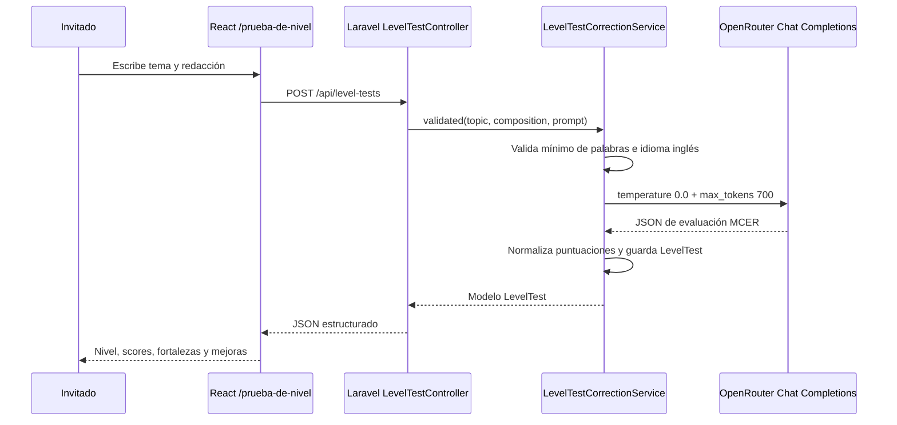

Arquitectura de Mensajería Optimizada: Se ha optado por un modelo de tabla dinámica para mensajes con una tabla pivote de destinatarios. Esto permite el envío masivo (Profesor -> Grupo) sin duplicar el cuerpo del mensaje en la base de datos, optimizando el almacenamiento.

Gestión de Asistencia Híbrida: Implementación de una tabla de asistencia que soporta modalidades presenciales y online. El sistema permite el marcado automático para clases online y la edición manual del docente, garantizando integridad en el seguimiento académico.

Theming Engine & Accesibilidad Dinámica: Uso de JSONB en PostgreSQL para almacenar perfiles de accesibilidad (dislexia, daltonismo) y configuraciones de marca blanca. Esto permite la inyección de estilos en tiempo de ejecución (Frontend) sin recargas de página.

Seguridad de Archivos: Implementación de un sistema de gestión de recursos con validación de tipos MIME y límites de tamaño (max 2MB) para prevenir ataques de denegación de servicio y optimizar el almacenamiento del servidor.

## Estrategia Hibrida de Contenido en Landing

Se adopto una estrategia hibrida para la portada publica del frontend:

- Textos editoriales versionados en codigo dentro de `frontend/src/data/homeData.js` (Hero, Features, Metodologia, Certificaciones, Contacto y metadatos de secciones).
- Oferta de cursos consumida en tiempo real desde `GET /api/courses` en `CoursesSection.jsx`, mostrando datos reales de base de datos.
- Cuando la API responde `401/403` (sesion no autenticada), la landing informa el requisito de login y mantiene boton de reintento.

Esta separacion es el estandar recomendado para un producto Open Source descargable porque combina dos necesidades complementarias:

- Personalizacion por fork: cualquier equipo que descargue el proyecto puede adaptar el discurso comercial modificando un unico archivo de configuracion sin tocar logica de componentes.
- Datos vivos en runtime: el catalogo de cursos no queda congelado en el bundle, sino sincronizado con lo que el equipo administra en backend.
- Mantenibilidad y escalado: se reduce duplicacion de strings, se facilita internacionalizacion futura y se evita acoplar contenido de marketing con entidades operativas.

## Prueba de Nivel IA

Se ha implementado el flujo público de evaluación de redacciones sobre la ruta `POST /api/level-tests`. El controlador mantiene el `CORRECTOR_SYSTEM_PROMPT` como constante privada y delega la lógica de negocio en `LevelTestCorrectionService`, respetando el patrón Service Layer: validación semántica, detección básica de idioma, llamada a OpenRouter, normalización del JSON y persistencia en `level_tests`.

La clave `OPENROUTER_API_KEY` se lee exclusivamente desde el entorno del backend mediante `config/services.php`. El frontend solo envía `topic` y `composition` mediante Axios, por lo que la credencial nunca se expone al navegador.

### Flujo técnico

### Componente frontend

| Componente | Props | Responsabilidad | Accesibilidad |
| :--- | :--- | :--- | :--- |
| `LevelTest` | Sin props | Página pública con formulario, llamada Axios y estados `idle/loading/error/ready`. | Usa `main`, `section`, `form`, labels asociados y regiones `aria-live`. |
| `LevelTestResult` | `result` | Renderiza nivel MCER, puntuación total, cuatro criterios, fortalezas, mejoras y consejo. | Usa encabezados jerárquicos y listas semánticas para feedback estructurado. |
| `LevelTestSkeleton` | Sin props | Feedback visual durante la llamada a la API. | Expone `role="status"` y evita cambios bruscos de layout. |
