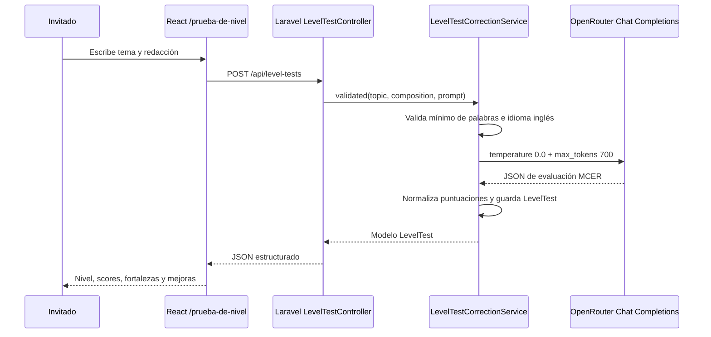

Arquitectura de Mensajería Optimizada: Se ha optado por un modelo de tabla dinámica para mensajes con una tabla pivote de destinatarios. Esto permite el envío masivo (Profesor -> Grupo) sin duplicar el cuerpo del mensaje en la base de datos, optimizando el almacenamiento.

Gestión de Asistencia Híbrida: Implementación de una tabla de asistencia que soporta modalidades presenciales y online. El sistema permite el marcado automático para clases online y la edición manual del docente, garantizando integridad en el seguimiento académico.

Theming Engine & Accesibilidad Dinámica: Uso de JSONB en PostgreSQL para almacenar perfiles de accesibilidad (dislexia, daltonismo) y configuraciones de marca blanca. Esto permite la inyección de estilos en tiempo de ejecución (Frontend) sin recargas de página.

Seguridad de Archivos: Implementación de un sistema de gestión de recursos con validación de tipos MIME y límites de tamaño (max 2MB) para prevenir ataques de denegación de servicio y optimizar el almacenamiento del servidor.

## Estrategia de Branding Agnóstico y Fallback de Marca

Para garantizar la flexibilidad de la marca blanca, se ha implementado un sistema de identidad dinámica que prioriza activos gráficos pero asegura una estética profesional mediante wordmarks tipográficos e isotipos basados en iniciales en su ausencia.

La configuración visual del sitio se centraliza en el objeto `branding` de `SiteConfig`, persistido en PostgreSQL como JSONB con la siguiente forma:

```json
{
	"site_name": "OpenClassy",
	"logo_type": "text",
	"logo_img_url": null,
	"isotype_img_url": null
}
```

Decisiones técnicas aplicadas:

- Backend: `UpdateSiteConfigRequest` valida el payload de branding y `SiteConfigService` normaliza valores por defecto para asegurar consistencia incluso cuando existan configuraciones antiguas o incompletas.
- Frontend: el componente reutilizable `Brand.jsx` consume `ConfigContext` y resuelve dos modos de representación. Para el logotipo, si `logo_type === 'image'` y existe `logo_img_url`, renderiza la imagen; en caso contrario muestra el `site_name` con la tipografía activa del tema. Para el isotipo, si falta `isotype_img_url`, genera automáticamente iniciales mediante `getInitials(name)`.
- Panel de administración: `AdminAppearance.jsx` incorpora un formulario para editar nombre del sitio, selector entre logotipo tipográfico o imagen, carga de archivos para logo e isotipo y una vista previa en vivo del fallback visual antes de guardar.

Justificación de persistencia:

- Se mantiene JSONB en PostgreSQL para evitar migraciones rígidas de base de datos cada vez que evolucione la identidad visual de una academia.
- Este enfoque permite ampliar la estrategia de marca blanca con nuevos atributos sin romper contratos existentes ni forzar cambios estructurales en tablas relacionales ya desplegadas.

## Estrategia Hibrida de Contenido en Landing

Se adopto una estrategia hibrida para la portada publica del frontend:

- Textos editoriales versionados en codigo dentro de `frontend/src/data/homeData.js` (Hero, Features, Metodologia, Certificaciones, Contacto y metadatos de secciones).
- Oferta de cursos consumida en tiempo real desde `GET /api/courses` en `CoursesSection.jsx`, mostrando datos reales de base de datos.
- Cuando la API responde `401/403` (sesion no autenticada), la landing informa el requisito de login y mantiene boton de reintento.

Esta separacion es el estandar recomendado para un producto Open Source descargable porque combina dos necesidades complementarias:

- Personalizacion por fork: cualquier equipo que descargue el proyecto puede adaptar el discurso comercial modificando un unico archivo de configuracion sin tocar logica de componentes.
- Datos vivos en runtime: el catalogo de cursos no queda congelado en el bundle, sino sincronizado con lo que el equipo administra en backend.
- Mantenibilidad y escalado: se reduce duplicacion de strings, se facilita internacionalizacion futura y se evita acoplar contenido de marketing con entidades operativas.

## Modelo de Usuario con Nombre y Apellidos Separados

Se implemento una evolucion de esquema en users para almacenar nombre y apellidos por separado, añadiendo first_name y last_name con migracion de datos heredados desde name.

Decisiones tecnicas aplicadas:

- Persistencia dual compatible: se conservan first_name y last_name como fuente de verdad y se mantiene name como nombre completo derivado para compatibilidad con consumidores existentes.
- Backfill automatico en migracion: los registros previos se descomponen desde name para no perder datos historicos.
- Ordenacion alfabetica por apellidos en API: los listados de usuarios (gestion y destinatarios) se ordenan por last_name y despues por first_name.
- Contratos de API actualizados: creacion/edicion/perfil aceptan first_name y last_name, manteniendo name como campo compatible para clientes antiguos.

Justificacion funcional:

- Permite ordenar alumnado, docentes y administradores por apellidos, que es el criterio academico habitual para busqueda y administracion.
- Mejora la calidad del dato para futuras funciones (filtros avanzados, exportaciones CSV, integraciones externas, etiquetas oficiales).
- Evita una ruptura brusca del ecosistema, al mantener compatibilidad con name mientras se completa la transicion de frontend y clientes API.

## Estado Operativo de Usuarios Activos e Inactivos

Se incorpora el campo `is_active` en la tabla `users` para representar el estado operativo de una cuenta de forma independiente a sus matriculas academicas. Esta decision evita utilizar `enrollments.status` como indicador global del usuario, ya que una matricula activa o inactiva solo describe la relacion del alumno con un curso concreto, no la vigencia administrativa de su cuenta en la academia.

Decisiones tecnicas aplicadas:

- Persistencia no destructiva: un usuario inactivo permanece en base de datos con su historial, entregas, asistencia, mensajes y trazabilidad academica asociados.
- Separacion de responsabilidades: `users.is_active` controla si la cuenta debe contarse y gestionarse como activa; `enrollments.status` mantiene el estado de acceso o participacion en un curso especifico.
- Compatibilidad de despliegue: la API y el modelo `User` incluyen protecciones ante esquemas antiguos para que el sistema siga funcionando durante transiciones de migracion.
- Visibilidad administrativa: el panel de usuarios permite activar o desactivar cuentas sin recurrir a eliminaciones irreversibles, y el dashboard calcula alumnado/docentes activos respetando este campo.

Justificacion funcional:

- En una academia es frecuente que un alumno pause su formacion y vuelva meses despues. Mantenerlo como inactivo conserva el contexto comercial y academico necesario para reactivarlo sin reconstruir su expediente.
- La desactivacion reduce errores operativos frente al borrado: se evita perder datos historicos, se mantiene la integridad referencial y se facilita la auditoria del ciclo de vida del usuario.
- El borrado queda reservado para casos administrativos concretos, mientras que el estado inactivo cubre bajas temporales, pausas de pago, descanso entre niveles o seguimientos pendientes de reincorporacion.

## Prueba de Nivel IA

Se ha implementado el flujo público de evaluación de redacciones sobre la ruta `POST /api/level-tests`. El controlador mantiene el `CORRECTOR_SYSTEM_PROMPT` como constante privada y delega la lógica de negocio en `LevelTestCorrectionService`, respetando el patrón Service Layer: validación semántica, detección básica de idioma, llamada a OpenRouter, normalización del JSON y persistencia en `level_tests`.

La clave `OPENROUTER_API_KEY` se lee exclusivamente desde el entorno del backend mediante `config/services.php`. El frontend solo envía `topic` y `composition` mediante Axios, por lo que la credencial nunca se expone al navegador.

### Flujo técnico



### Componente frontend

| Componente | Props | Responsabilidad | Accesibilidad |
| :--- | :--- | :--- | :--- |
| `LevelTest` | Sin props | Página pública con formulario, llamada Axios y estados `idle/loading/error/ready`. | Usa `main`, `section`, `form`, labels asociados y regiones `aria-live`. |
| `LevelTestResult` | `result` | Renderiza nivel MCER, puntuación total, cuatro criterios, fortalezas, mejoras y consejo. | Usa encabezados jerárquicos y listas semánticas para feedback estructurado. |
| `LevelTestSkeleton` | Sin props | Feedback visual durante la llamada a la API. | Expone `role="status"` y evita cambios bruscos de layout. |
